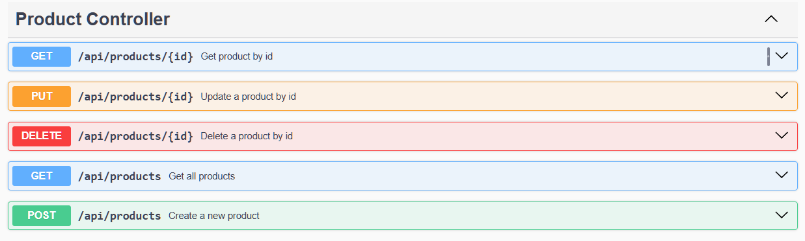

## Why this project

I spent six years working on the operations side of an e-commerce
company — catalog, orders, customers, after-sales. This project
rebuilds that same domain from the backend side, as part of my
transition into backend development. It's a learning project, built
one feature at a time: the roadmap reflects what's next, not what's
already done.

# E-commerce Backend API

REST API for an e-commerce platform, built as a structured
learning project. Currently in active development.

## Tech Stack

- Java 21
- Spring Boot
- Spring Data JPA / Hibernate
- PostgreSQL
- Maven

## API Endpoints

| Method | Path               | Description           | Status  |
|--------|--------------------|-----------------------|---------|
| GET    | /api/products      | Get all products      | 200     |
| GET    | /api/products/{id} | Get a product by id   | 200/404 |
| POST   | /api/products      | Create a new product  | 201     |
| PUT    | /api/products/{id} | Update a product by id| 200/404 |
| DELETE | /api/products/{id} | Delete a product by id| 204/404 |

## API Documentation

Interactive API documentation is available at
`http://localhost:8080/swagger-ui.html` when the application is running.

## Getting Started

### Prerequisites

- JDK 21
- PostgreSQL

### Setup

1. Clone the repository:

   git clone https://github.com/giuseppecorso/ecommerce-backend.git

2. Create the database (from psql):

   CREATE DATABASE ecommerce;

3. Set the environment variable DB_PASSWORD with your PostgreSQL password.

4. Start the application:

   ./mvnw spring-boot:run

   (on Windows: mvnw.cmd spring-boot:run)

The API runs on http://localhost:8080

## Example Requests

### Create a product

    curl -X POST http://localhost:8080/api/products -H "Content-Type: application/json" -d "{\"name\": \"Felpa Adidas\", \"description\": \"Felpa con cappuccio nera\", \"price\": 39.99, \"stockQuantity\": 5}"

Response — 201 Created:

    {"id":3,"name":"Felpa Adidas","description":"Felpa con cappuccio nera","price":39.99,"stockQuantity":5}

### Update a product

    curl -X PUT http://localhost:8080/api/products/3 -H "Content-Type: application/json" -d "{\"name\": \"Felpa Adidas\", \"description\": \"Felpa con cappuccio blu\", \"price\": 34.99, \"stockQuantity\": 8}"

Response — 200 OK:

    {"id":3,"name":"Felpa Adidas","description":"Felpa con cappuccio blu","price":34.99,"stockQuantity":8}

The id comes from the URL, not from the request body.

### Invalid input

    curl -X POST http://localhost:8080/api/products -H "Content-Type: application/json" -d "{\"name\": \"\", \"description\": \"test\", \"price\": -5, \"stockQuantity\": -1}"

Response — 400 Bad Request:

    {"price":"must be greater than 0","name":"must not be blank","stockQuantity":"must be greater than or equal to 0"}

Validation runs before the controller method is invoked. Field errors are
collected by a @RestControllerAdvice handler and returned as a
field-to-message map.

## Request and response models

The API does not expose the JPA entity. Incoming JSON is bound to a
ProductRequest, which carries the validation constraints and has no id
field: an id sent in the request body has nowhere to be mapped and is
discarded. Outgoing JSON is built from a ProductResponse, so changes to
the persistence model do not silently change the public API.

## Roadmap

- Order management
- Unit tests (JUnit)
- Payment module